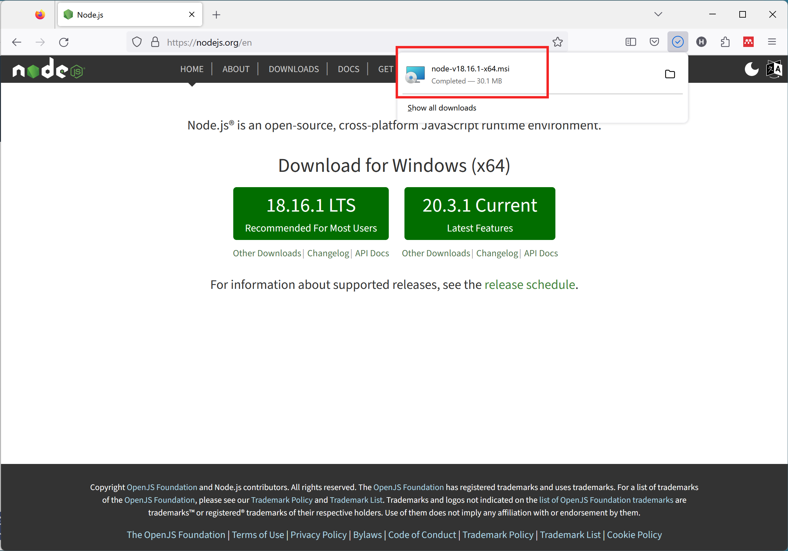
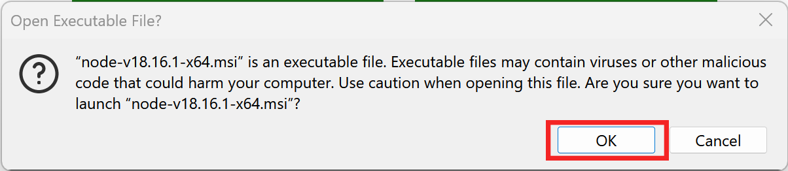
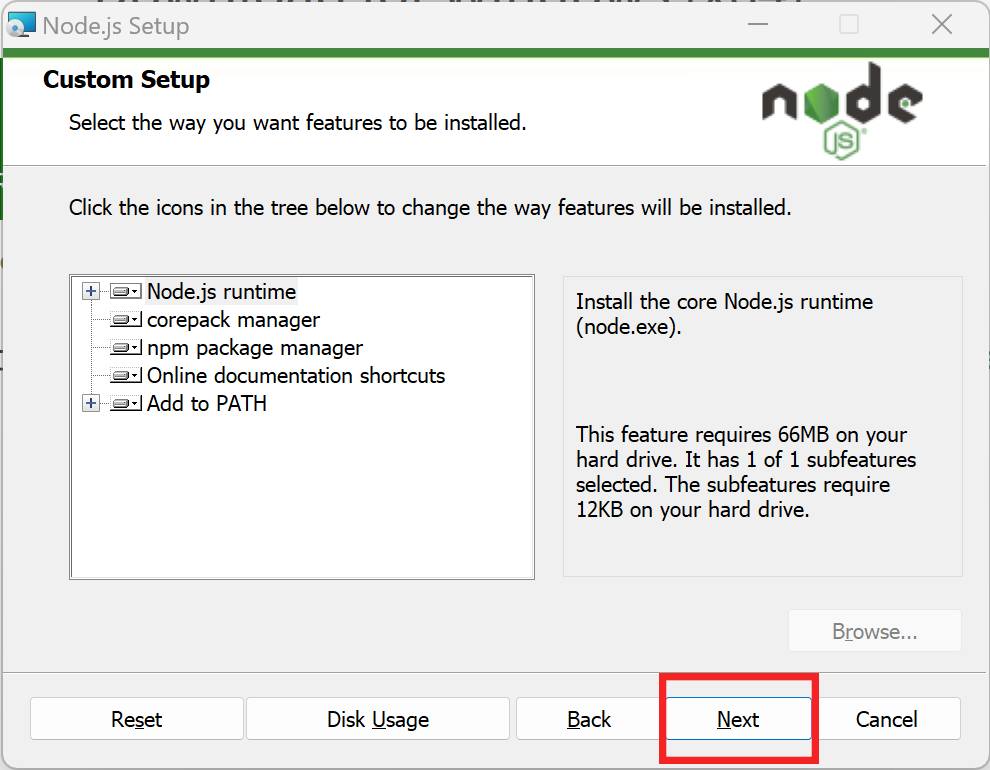
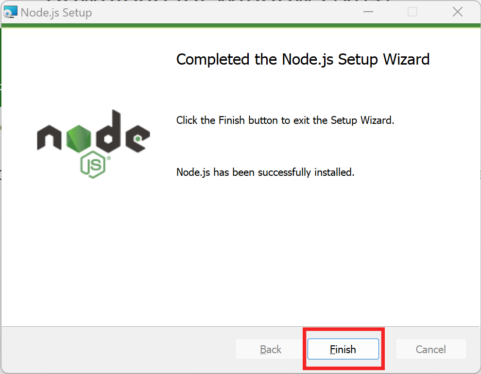
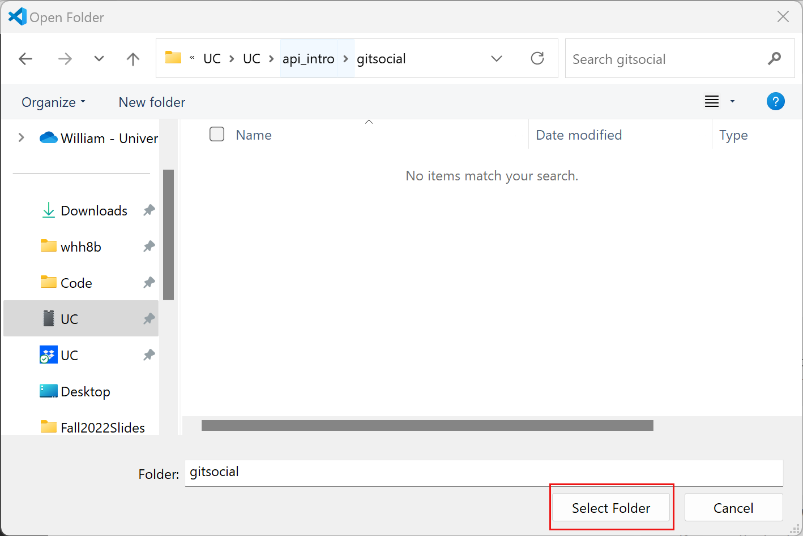
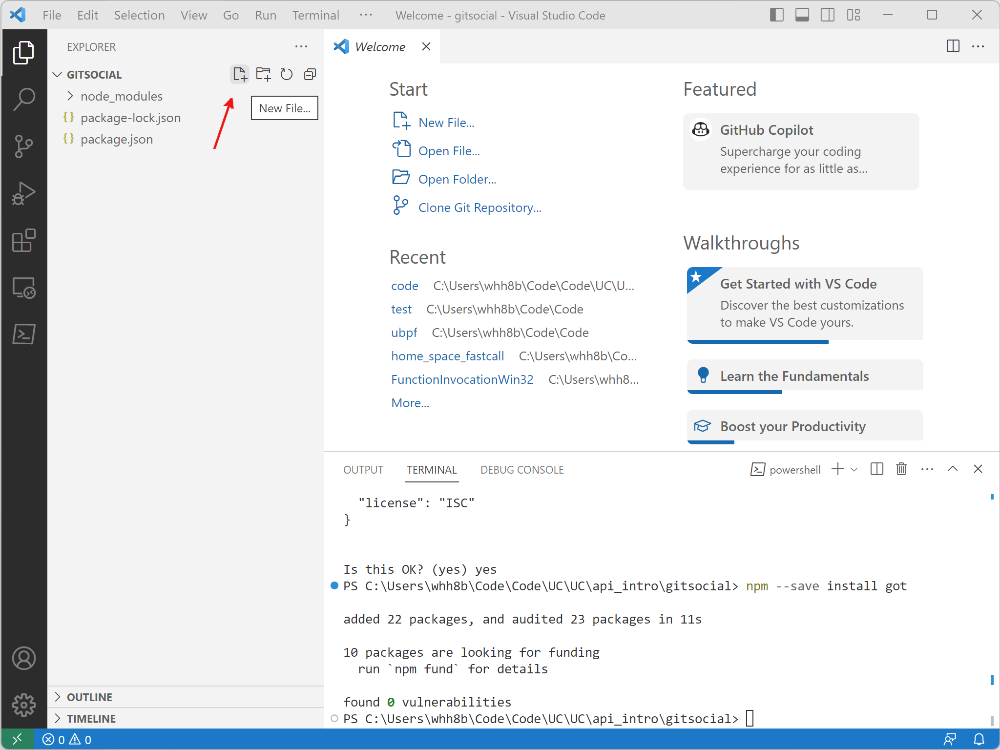

# An Intro to Using HTTP APIs with Node.js

## Our Mission

It's great to be part of a community. GitHub is a great site for connecting with a *community* of other developers working on similar projects. GitHub lets you follow developers, star their repos, see what they are working on, etc. What it does *not* let you do, sadly, is communicate directly with another developer on the site (unless you are both working together on a PR, or issue, etc). 

However, GitHub gives each developer the option to list their social media links on their GitHub home page so that other developers can contact them on those sites! Problem solved!


Here, my friend's Twitter handle is `@washedPatrick`. I can go on Twitter and message him using that handle.

He can then go to my GitHub repository to find my Twitter handle so that he can respond:


That's great and all, but we're developers and we would prefer to automate the process of finding out how to connect with our peers on social media. If only there were some way that we could query GitHub's database of profiles and "fetch" all the social media links for a particular user. 

Well, have no fear, because there is!!

In this tutorial we are going to study how we can use HTTP APIs, the "things" that give us access to information like we talked about above, by writing JavaScript code! 

Just what are we going to learn?

1. How to install and use Node.js to write a JavaScript application that executes *outside* the web browser.
1. How to install and use VS Code to write *and* debug JavaScript applications built for Node.js.
2. The definition and value of software libraries (especially ones like HTTP APIs that do not even exist on our computers).
3. Some very basic JavaScript.
4. How to use a package manager to access/use code that another person has already written and debugged.

Let's go!

## Node.js

ECMAScript, the formal name for the JavaScript programming language, finds its most common use in the web browser. Firefox, Chrome, Safari, Brave and all the other major web browsers have support for running programs written in JavaScript. Before JavaScript became the language it is today, most web sites were designed to be read -- their content was static and user interaction with the material was limited, at best. As JavaScript grew more powerful, JavaScript programs turned web sites into web apps. Because JavaScript programs can run the same way in *every* web browser (although that is the ideal, the truth is far different), many developers know the language well. In modern lingo, JavaScript programs that run in a user's web browser are known as frontend applications and developers who write those applications are known as frontend developers.

On the other hand, most of the server software (e.g., web servers, database servers, etc.) that people write have historically been written in languages with a steeper learning curve: C, C++, Java, Python, etc. Fewer people know these languages which means that the pool of developers qualified to write server software was smaller. Server software are referred to as backend software and its developers are known as backend developers. 

Because knowledge of programming in JavaScript is so pervasive, developers thought that it would be great to empower those JavaScript junkies to write server software. Because JavaScript was a language designed to build frontend applications that execute in a web browser, there are many things missing from the language that are required for writing servers: JavaScript does not give its programmers the ability to access a computer's storage or peripherals, for example. Most importantly, however, JavaScript programs cannot execute natively on a server. Unlike a program written in a language that is compiled to machine code (e.g., C, C++, Rust, etc), JavaScript programs must be executed by a runtime. Each web browser has a built-in runtime (Chrome has [V8](https://v8.dev/), Firefox has [SpiderMonkey](https://firefox-source-docs.mozilla.org/js/index.html), Safari has [JavaScriptCore](https://developer.apple.com/documentation/javascriptcore)).

So, right off the bat, the people who wanted to expand server development to JavaScript programmers needed to figure out how to build a JavaScript runtime that would make it possible for programs written in JavaScript to

1. execute on the server (with reasonably good performance!); and
1. access all the pieces of the operating system required for writing servers.

They accomplished this technical feat by isolating those JavaScript runtimes from the browser, wrapping them in some wizardry, and publishing them as standalone applications. The result are so-called JavaScript runtimes (I know, it's confusing, sorry!) like Node.js, Deno, and Bun ([among others](https://en.wikipedia.org/wiki/List_of_server-side_JavaScript_implementations)).

Because JavaScript is standardized (as ECMAScript), it *should* be possible to write a program in JavaScript that will run the same way in any of those runtimes. That is, however, not entirely true -- each runtime supports the standard to various degrees and each offers their own extra special goodies.

In this tutorial we will use Node.js as the server runtime. The JavaScript program that we are going to write is not server software, per se. However, it will be a useful approximation in so far as both the application that we write and server software execute on a server (as opposed to in the browser) and both usually require access to external resources.

### Getting Started With Node.js

All the tools that you need to write software in JavaScript and execute it in Node.js are freely available on the Internet. Before going any further, make sure that you have [VS Code](https://code.visualstudio.com/download) installed on your Windows computer (versions of the tutorial for macOS and Linux are forthcoming). 

To start, download the Node.js installer from their website, [nodejs.org](https://www.nodejs.org).


Install the latest "LTS" version of Node.js. LTS stands for Long-Term Stable and describes a version of software that the Node.js developers guarantee they will support for an extended period of time by releasing security and stability updates, where needed.

After the installer has finished downloading, click on the downloaded file to launch it.



Depending on your browser and security settings, you may see a prompt warning you about executing programs downloaded from the Internet.



During the installation process, accepting the defaults is usually the best approach. The only caveat is that you will need to accept the license agreement for the software.


Be sure to check the box highlighted in green before clicking `Next`.

For the remaining steps, accepting the defaults is the way to go:





After clicking `Next`, Windows will prompt you to give the installer privileges to make changes to your hard drive. Unless you consent, the installer will not work.


Congratulations! You made it!



## APIs

Programmers are lazy people. They do *not* want to do again work that someone else has already one. That, of course, is the cynical description of programmers. The more generous description of programmers is that they are at pains to make sure that someone else's good work gets reused. 

In all seriousness, software reuse is at the bedrock of good software architecture. There are many reasons why it make sense for a programmer to reuse another piece of software that is well written, well maintained and well tested. That discussion, however, is for another day. Let's grant the premise that software reuse is a good thing.

Let's talk about software reuse at a local level. In your projects you will often write functions that accomplish some task that you might need to execute over and over again. Great, now you can reuse that functionality by doing a local function call. However, you might want to share that functionality with developers from another project who needs the same behavior. If they are writing software for the same type of hardware as you are and using the same language, you can package your functions in a *library* and share it with them. Those developers would import your library and, again, execute local function calls to reuse it. 

Writing functions allows *you* to reuse your software. Writing libraries allows *more* people to reuse your software. But what if you wanted *everyone* to be able to use your software? You would put that function on a server on the Internet and let people execute it *remotely*. When someone used your software they would be performing a *remote* function call (in the lingo these calls are known as *RPC*s for *remote procedure call*s -- procedure is (almost) a synonym for function). In order for everyone to understand the inputs and outputs of your globally accessible function (i.e., the parameters that it needs to execute and the results that it produces), there needs to be a specification. Such a specification is known as an application programming interface, an *API*. 

Historically there have been many ways to perform RPCs -- CORBA, Open Network Computing, Java RMI, SOAP, etc. The common way to perform RPCs today is to make requests via HTTP. APIs that are invoked over HTTP (and meet other criteria) are usually referred to as REST APIs: [REpresentational State Transfer](https://en.wikipedia.org/wiki/Representational_state_transfer). The "big idea" is that every request from the user of the RPC must contain enough information for the server to execute without having to maintain any *state*, information specific to the caller's invocation of the function. 

For example, when you call Papa John's and order a pizza, there is a conversation between you and the person answering the phone:

* You
    > I'd like to order a large, two topping pizza.
* Them
    > What is the first topping that you would like?
* You
    > Cheese.
* Them
    > What is the second topping that you would like?
* You
    > Pineapple
* Them
    > Great, a two topping large pizza with pineapple and cheese will be $17.00.

Despite the fact that pineapple does not go on pizzas, for the duration of the phone call, the operator needs to remember that you are asking for a two-topping large pizza and all the toppings that you have requested so far, how many you still need to select, etc. That is *state*.

Consider this alternate form of the same conversation:

* You
    > I'd like to order a large, two topping pizza.
* Them
    > You need to tell me the toppings you want on your large, two topping pizza.
* You
    > I'd like to order a large, two topping pizza with cheese.
* Them
    > You need to tell me the toppings you want on your large, two topping pizza.
* You
    > I'd like to order a large, two topping pizza with cheese and pineapple.
* Them
    > Great, a two topping large pizza with pineapple and cheese will be $17.00.

During this conversation, the operator only needs to have listened to the most-recent bit of dialogue to remember what they were doing. In other words, the operator needs no state. The ability to serve customers without keeping state would make it easier for the operator to serve multiple clients at the same time and maintain their sanity.

In an HTTP invocation of an RPC, the contents of a request and response are often encoded in JSON, the *JavaScript Object Notation*. The encoding mechanism is so called because it is a way to write down how an object in a program written in the JavaScript language would look if you wrote it out (to the screen, to a piece of paper, etc). The process of writing out a representation of something in the memory of a computer program is known as serialization. 

The awesome thing about data encoded in JSON format is that the programmer can read in that data and then *deserialize* it, convert it from the written-out format back in to an in memory representation that can be used directly in a program.

Woah!

You will see just how powerful that convenience is as we tackle our development!

Oftentimes local functions are meant to accomplish some task and perform some action -- write data to a file, make something appear on the screen. There are HTTP APIs that also accomplish tasks and perform actions. Some of the most famous web-based businesses publish HTTP APIs that perform actions like sending text messages (Twilio), computing a route between two waypoints (Here.com), transferring money between bank accounts (Stripe, Zelle), or authorizing users (PingOne, Duo). 

However, a majority of people use HTTP APIs to make RPCs that simply access databases. In a way, these remote procedures that deliver data on demand *are* procedures. But, in a way, they aren't. Nevertheless, these databases are accessible by HTTP APIs and are wildly popular. Some of the most famous ones include the Facebook API, the Instagram API, the Google Maps API, and so on.

In order to make a RPC to an HTTP API you need to know that API's *endpoint*. The *endpoint* is the address to which you connect in order to invoke the reusable functionality. For a REST HTTP API, the endpoint usually looks like any other URL.


### Making APIs Real and Tangible

Just what does it look like, practically, to call an HTTP API. In fact it's not much different than loading a web page. You can technically make a RPC over HTTP using your web browser.

Paste the following endpoint in your web browser:

```
https://api.sunrise-sunset.org/json?lat=39.1031&lng=-84.5120&date=2021-11-10
```

That URL invokes an HTTP API that will display information about the sunrise/sunset of any location on earth for any day in history. The HTTP API access above (called a *query*) contains all the arguments for the API's parameters. You don't even have to look that close to see them:

The `lat=` after the `?` means that the next value in the string is an argument for the `lat` parameter (the latitude); the `lng=` after the `&` means that the next value in the string is an argument for the `lng` parameter (the longitude); and the `date=` means that the next value in the string is an argument for the `date` parameter. The `&`s separate the parameter/argument pairs. 

Put all that information together and the query above is, essentially, asking the `sunrise-sunset.org` API for information about the sunrise/sunset on November 10th, 2021 in Cincinnati, OH. 


The result of that RPC invocation is formatted in JSON and your web browser knows how to pretty print the results. So, each of the labels in blue are the names of fields and the values in pink are the corresponding data bits. The output indicates that the sunrise in Cincinnati in November of 2021 was at 12:21:41 PM (yes, *PM* -- they are encoded in GMT). 

The amount of data accessible with these APIs is endless and it's really cool to see how things work!

## Nuts and GitHub Bolts

Returning to the task at hand -- we want to use a GitHub HTTP API in order to fetch the social media links for a particular user. Before we write a program in JavaScript to access this information, let's explore the API first and see what information is available.

> Note: When you are writing software that accesses any API, it is usually a very good idea to explore the API by hand before you start writing code. Making one-off calls to reusable code (whether that is a local function call or an RPC accessible as an HTTP API), knowing well how the API works will help you eliminate uncertainty when you are debugging your code: Is what I wrote incorrect or is there something odd about the interface? 

In order to access all the social media links for a particular user on GitHub, you can make a RPC to the HTTP API endpoint at

`https://api.github.com/users/`*username*`/social_accounts`

If you have a GitHub account and have registered your social media accounts, you can try it for yourself. My username on GitHub is `hawkinsw`. In order to retrieve all the social media accounts linked to my GitHub username you would call the GitHub API over HTTP by accessing the 

```
https://api.github.com/users/hawkinsw/social_accounts
```


As before when we were experimenting with the Sunrise-Sunset API, the result of the RPC is JSON and the web browser is pretty printing it to make it easier to read.

Because of the verbosity and self-documenting nature of JSON, you can almost read the data that we are after:

> The user `hawkinsw` has `0`, `1` social media accounts linked to their username. The `0`th account is from Twitter and the URL is `https://twitter.com/hawkinsw`. The `1`th account is from a generic social media company and the user `hawkinsw` can be contacted at `https://bsky.app/profile/hawkinsw.bsky.social` on that platform.

Experiment with the endpoint and make sure you see how it works. As we discussed above, having a good sense of how the API works will make it *that* much easier to access it programmatically in code.

## Building Software in the Node.js Ecosystem

Now that you know what APIs are, why you want to use them and several examples of their functionality, let's use JavaScript to write a backend program that will access a particular API and display its results.

No developer works alone -- we all write software that builds upon the tools and code that others have written before us. Whether we rely on the operating system, a library from another developer, or a function written by "past us", we are all using code from another developer.

Traditionally one of the hardest parts about software development has been finding and integrating these reusable pieces of functionality into a new project. In the past you would have to go out and find some useful source code, add it to your project, determine how to reference that code from your code, and so on.

Well, besides blowing open the opportunity to write server software to JavaScript developers, Node.js (and the other runtimes, too), revolutionized software engineering by introducing something called a *package manager*.

> Note: There have been package managers around in other forms for a long, long time. However, the Node.js Package Manager (NPM) was the first one that really caught the attention of an entire developer community.

Thanks to the Node.js Package Manager (NPM), you can issue a few simple commands and have access to any of a number of different libraries that have useful functionality for reuse.

NPM has a repository ([online](https://www.npmjs.com)) where 

1. developers can post packages for others to use; and
2. developers can look for packages to use in their projects.

When a developer wants to share some of their functionality with others, they simply publish their code to the repository. And then, when a developer wants to reuse someone's functionality, they can use a tool on their computer to download that package and have it immediately available for reuse.

For the project we are writing, it will be useful to be able to download data from the network using HTTP -- after all, that *is* what calling an HTTP API is all about! Unfortunately, writing code to access resources over the Internet, especially ones hosted on a web server, is not easy. 

Enter NPM which hosts a package just for that: `got`.

Before we can reach out and access that functionality, we will need to till the soil, so to speak.

### Initializing a New Project

First things first: we will need a place to store our code -- a well-named folder is always a good idea -- and we will need to configure our IDE so that it knows we are working with code in that folder. We can do both of those at the same time with VS Code.

Click on `Open Folder` under the `File` menu.


Then navigate to the place on your hard drive where you would like to store code for this project.

Click on the `New Folder` button to create a folder just for the code for this project.


Then you will descend in to that newly created folder by double clicking (I know, it's odd that Windows does not automatically do that for you, but ..).


Once you are in the newly created folder (which will have no contents), you can `Select Folder`:



With that, have to (basically) instructed VS Code that the newly created folder is a "workspace" for your project. Our configuration and project building can now really pick up some speed!

Now that we are starting to work with real code, we'll have to sometimes use another tool from VS Code -- the *terminal*. The terminal gives you access to an interface to issue commands (in a text format) to the computer. Working effectively in the terminal is real skill and one that developers spend lots of time practicing. Every platform (Windows, macOS, Linux) has individual pieces of software that will give you access to the terminal (a *terminal emulator*) and each of those packages has its pros and cons. What's cool about VS Code is that there is a (reasonably decent) built-in terminal emulator. In order to access the terminal emulator in VS Code, click on `New Terminal`.


What appears is the terminal window and it's a place where you can enter commands for the operating system to execute.

*Now* we can finally start to use the Node.js Package Manager! In order for our software to easily reuse functionality posted in the NPM repository, we will create a project. In the terminal window, type :

```console
npm init
```

and then press Enter. `npm` will prompt you through the steps of creating a new package:

```
This utility will walk you through creating a package.json file.
It only covers the most common items, and tries to guess sensible defaults.

See `npm help init` for definitive documentation on these fields
and exactly what they do.

Use `npm install <pkg>` afterwards to install a package and
save it as a dependency in the package.json file.

Press ^C at any time to quit.
package name: (scratch) 
```


I recommend calling your project `getsocial` (because we are going to use `G*i*tHub`) to access information about a developer's presence on social media. To do that, just type `getsocial` and press enter. The next question asks you to set the value for `getsocial`'s latest version.

```console
version: (1.0.0)
```

The value in `()`s is the *default* choice and if you want to accept that value (I recommend that you do), simply press return. You can complete the remainder of the `npm init` process by either accepting the defaults or setting meaningful customized values. The only item that you must set precisely is the `entry point` option -- simply set it to `index.js`. That is setting the name of the file that will contain the code that starts our application!

The result of the initialization process is several new files. The most important one is the `package.json` file. It describes your package (for future you and, potentially, for others if you post it on the NPM repository eventually) but, crucially, also keeps track of the software that your package relies on from the NPM repository.

If you look inside `package.json` that `npm init` created, you will see something like


```json
{
  "name": "gitsocial",
  "version": "1.0.0",
  "description": "Getting social media information from GitHub",
  "main": "index.js",
  "scripts": {
    "test": "echo \"Error: no test specified\" && exit 1"
  },
  "author": "Will Hawkins",
  "license": "GPL-3.0-or-later"
}
```

The file should not contain anything surprising -- just exactly the things you just typed in when prompted by `npm init`. Now here comes the cool part.

### `got` To Get A Package

So far we have come a very long way, even though we haven't yet written any code. We have

1. Learned *what* is an API;
2. Learned *how* we access that API remotely;
3. Learned *why* we want to use APIs;
4. Configured the IDE; and
5. Initialized a Node.js project.

Time to take a break. 

Just kidding, of course. Lets keep moving and set ourselves up so that `gitsocial` can reuse the functionality provided by the `got` library:

```console
npm install --save got
```

Something like

```
up to date, audited 23 packages in 512ms

10 packages are looking for funding
  run `npm fund` for details

found 0 vulnerabilities
```

should have popped up on your screen (red arrow).


You will see a few things have changed. First, there is a new directory named `node_modules` in the current folder (blue arrow). That folder contains the code for the `got` library that you just installed. Second, a few new items were added to `package.json`:

```json
{
  "name": "gitsocial",
  "version": "1.0.0",
  "description": "Getting social media information from GitHub",
  "main": "index.js",
  "scripts": {
    "test": "echo \"Error: no test specified\" && exit 1"
  },
  "author": "Will Hawkins",
  "license": "GPL-3.0-or-later",
  "dependencies": {
    "got": "^13.0.0"
  }
}
```

The new entries after `dependencies` reflect the that you told NPM that for your software to work, it *must* have access to the `got` package. Then, if you ever move to a new computer and start developing this software there, NPM will know which pieces of external code it will have to download from the NPM repository in order to make it possible for you to write more code! 

How cool is that?

NPM does *so* much more than what we've just described and you will learn all that functionality as your learn and grow as a developer.

> Note: Whether you realize it or not you are already get expertise and experience with the JSON format. I am sure that you noticed that the `package.json` had the `.json` file extension and I bet you were wondering what that had to do with the JSON format we described above! Well, as you can see, the contents of the `package.json` file are just, well, JSON! How cool is that??

## Drumroll, please ...

Now the moment that we have been waiting for ... writing some code. 

Psych!

We have to do one other bit of plumbing! Remember when we were running `npm init` and accepting all of its defaults? Well, one of those defaults was the name of the file where the main pieces of code for our project will go. By default, NPM wanted us to put the main pieces of the project's code in `index.js` and we agreed. So, we will need to create such a file so we can start adding JavaScript to it.

Click on the `New File` icon and name the file `index.js`.



If your screen looks (something) like 


then you are ready to roll! Let's get started!

In the `index.js` file, let's write a very simple program and see how to execute it using Node.js. 

```javascript
console.log(`Hello, World!`)
```

That line of code will produce the words `Hello, World!` on the screen. Do you believe me? You should! But, also, I don't blame you. So, let's verify! If we want to run the code that we have written and see what it produces, we have two options. 

The first way to execute a piece of JavaScript that we have written is to us the UI. In the `Run` menu, click on `Start Debugging`. The first time that you execute a JavaScript program with Node.js in this way, VS Code will ask which runtime to use. Of course, we want Node.js, but VS Code does not know that. When you click `Start Debugging` you will see popup window asking how to execute the JavaScript in `index.js`. Click on `Node.js`. 

```console
Hello, World!
```

Wow! Just what we expected! What is the difference between `Start Debugging` and `Run Without Debugging`? Well, the former instructs Node.js to begin executing the program written in JavaScript and give you the opportunity to stop it at any moment and inspect its status using a very powerful piece of software known as the debugger. You will become an expert using the debugger as you work through your career. There are debuggers for (almost) every programming language and environment. The debugger for JavaScript built in to VSCode is reasonable!

The second way to execute a piece of JavaScript that you have written is in the terminal. Open up a terminal window (remember how we do that?). Next, make sure that we are in the proper directory. Every time you issue a command using the terminal on the command line, it is executed in the context of a particular directory (i.e., a *folder*). The directory forming the context in the terminal is known as the *working directory*. Thanks to the working directory, any command executed can refer to files in that directory without having to give a complete *path*, or list of the folders encompassing a particular file with respect to the base of the hard drive. In order to see the names of the files that are "in" the working directory, we can execute `dir`. Give it a try:

```console
$ dir
```

The output will be (something like):
```console
index.js  node_modules  package.json  package-lock.json
```

What do you know? `index.js` (the file where we have the code for our program) is right there!

To instruct Node.js to execute the JavaScript in that file, we can issue the following command:

```console
node index.js
```

and the output should be:


```console
Hello, World!
```

Let's do some more introductions. Make sure that the code in your `index.js` looks like:

```JavaScript
console.log(`Goodbye!`)
console.log(`Hello, World!`)
```

Using your favorite technique for running JavaScript programs using Node.js, run the new program.

```console.log
Goodbye!
Hello, World!
```

There are few important things to notice here:
1. We are saying goodbye before we are saying hello! Odd!
2. Node.js appears to be executing each of the JavaScript statements from the top of the file containing the program's source code to its bottom.

Fix up the JavaScript program that we are writing so the it says hello and goodbye in the proper order.

## Doing Real Work

The format of the code in a JavaScript program is much different than in other languages. For instance, in C++, statements outside functions are not executable and all the code that can be executed needs to be in either a function or a class.

> Note: That is not *entirely* true.

The Node.js runtime will execute the statements in a JavaScript program from top to bottom and (essentially) skip any JavaScript that is in a function or class that is not specifically invoked. How wild is that?

In order to keep our code nice and tidy, we will write all of our code in functions and then invoke a "main" function as the sole executable statement outside a function in `index.js`. That will help us in two weeks when we come back to this program and try to decipher our intentions.

Because it will be the main point of departure for a program's execution, let's name the function `main`. Our function will take no parameters and it will return no values. 

```JavaScript
function main() { 

}
```

is how to define a simple function in JavaScript that takes no parameters and returns no values.

Put your updated `console.log` statements inside the `main` function:

```JavaScript
function main() { 
  console.log(`Hello, World!`)
  console.log(`Goodbye!`)
}
```

Now, run your program:

```console
```

Where did our output go? Well, we moved all the executable code into a function definition (something that is not executable) but then never invoked that function! Geez. We can easily fix that:

that 

```JavaScript
function main() { 
  console.log(`Hello, World!`)
  console.log(`Goodbye!`)
}

main()
```

And now we get our functionality back:


```console
Hello, World!
Goodbye!
```

## Build It And They Will Come

Remember [back](#nuts-and-github-bolts) to the exploration that we did of the GitHub API for fetching the social media links for a particular user? The API endpoint had a certain pattern to it:

```
https://api.github.com/users/<username>/social_accounts
```

In order to call the HTTP API to get the links to the social media accounts for different users, we could just swap out `<username>` in the endpoint URL: 

```
https://api.github.com/users/hawkinsw/social_accounts
https://api.github.com/users/kenballus/social_accounts
https://api.github.com/users/dnjp/social_accounts
```

Let's write a function that we can use to create those URLs. We can use the resulting URLs when we want to call the API. By putting the functionality of creating the endpoint URL into a local function, if the format of it ever changes we will minimize our work!

We will call our function `socialMediaEndpointGenerator`. What are the inputs that `socialMediaEndpointGenerator` needs to do its job? Only one: a username.

You already know the basic boilerplate for writing a function -- we are only going to add to it the ability to accept a single parameter named `username`:

```JavaScript
function socialMediaEndpointGenerator(username) {

}
```

Excellent! The code above declares the function and tells the language that its caller is expected to pass an argument to match with the `username` parameter. 

We can break down the endpoint URL into a part that comes before the username and a part that comes after the username. We will put each of those in separate variables:

```JavaScript
function socialMediaEndpointGenerator(username) {
  let root = "https://api.github.com/users/"
  let stem = "/social_accounts"
}
```

`root` and `stem` are *variables*, named places in memory that can hold values that vary during the course of execution of your program. (*Note*: `username` is a variable but we are not required to type `let` in front of it) If you are coming to JavaScript with experience in languages that are strongly typed you might be wondering: "What types of values can `username`, `root` and `stem` hold?" A great question! JavaScript is a *weakly typed language*, the values that a variable can hold do not all have to be of the same ilk. In a weakly typed language, a single variable can, at various points during the execution of a JavaScript program, hold different kinds of values (e.g., a number, then a string, then a true/false). Declarations are simply there to introduce variable names to the compiler and tell neither the compiler nor the program anything about what values it contains!

> In the interest of full disclosure, you can also introduce variables in a JavaScript program using the `var` keyword. Since the introduction of `let` to the JavaScript language in 2015, the use of `var` has (rightly) diminished and [most people](https://developer.mozilla.org/en-US/docs/MDN/Writing_guidelines/Writing_style_guide/Code_style_guide/JavaScript#variable_declarations) believe that `let` is keyword to use to declare a variable.

We have all the pieces of the puzzle to create the endpoint URL -- we just need to *concatenate* (stick together) the three pieces: the `root`, the `username` and the `stem`:

```JavaScript
function socialMediaEndpointGenerator(username) {
  let root = "https://api.github.com/users/"
  let stem = "/social_accounts"

  let url = root + username + stem
}
```

Even though we traditionally associate `+` with operations on numbers, JavaScript's lack of types mean that it has some niceties that make it easier to use in certain scenarios. Here is one of them! When JavaScript sees that you are attempting to "add" two (or more) strings together, it realizes that you are actually attempting to concatenate their contents!

One last trick: Just how is the `url` that the function creates getting returned to the caller of the function? Well, the question contains a hint! We will just `return` that value:

```JavaScript
function socialMediaEndpointGenerator(username) {
  let root = "https://api.github.com/users/"
  let stem = "/social_accounts"

  let url = root + username + stem
  return url
}
```

So. Cool.

Let's play around with it and see how it works. We will invoke it several times with different usernames and *log* the result to the screen (using our friend `console.log`):

```JavaScript
function socialMediaEndpointGenerator(username) {
  let root = "https://api.github.com/users/"
  let stem = "/social_accounts"

  let url = root + username + stem
  return url
}

function main() {
  let endpoint = socialMediaEndpointGenerator("hawkinsw")
  console.log("Endpoint: " + endpoint)
}

main()
```

```
Endpoint: https://api.github.com/users/hawkinsw/social_accounts
```

Pretty cool! Play around with the code by calling the `socialMediaEndpointGenerator` function with different arguments and seeing what the function generates!

We said that variables are meant to hold values in memory that change throughout the course of program execution. What do you notice about the values of `root` and `stem`? That's right: Once they are given their initial contents, their value remains *constant*, or unchanging, throughout execution. JavaScript gives us a way to tell our fellow programmers keep their hands off of the variables whose values we know are not going to change throughout execution: Instead of declaring them with `let`, declare them with `const`:

```JavaScript
function socialMediaEndpointGenerator(username) {
  const root = "https://api.github.com/users/"
  const stem = "/social_accounts"

  const url = root + username + stem
  return url
}

function main() {
  const endpoint = socialMediaEndpointGenerator("hawkinsw")
  console.log("Endpoint: " + endpoint)
}

main()
```

Everything still works, right? Exactly! If one of our coworkers comes along and thinks that they know better than us and wants to change the `root` or the `stem` after they are given their initial values, JavaScript will yell:

```JavaScript
function socialMediaEndpointGenerator(username) {
  const root = "https://api.github.com/users/"
  const stem = "/social_accounts"

  const url = root + username + stem

  root = "https://www.bsky.app"
  return url
}

function main() {
  const endpoint = socialMediaEndpointGenerator("hawkinsw")
  console.log("Endpoint: " + endpoint)
}

main()
```

```
Process exited with code 1
Uncaught TypeError TypeError: Assignment to constant variable.
    at socialMediaEndpointGenerator (/home/hawkinsw/code/uc/api_intro/code/index.js:55:8)
    at main (/home/hawkinsw/code/uc/api_intro/code/index.js:60:20)
    at <anonymous> (/home/hawkinsw/code/uc/api_intro/code/index.js:64:1)
    at run (internal/modules/esm/module_job:197:25)
    --- async function ---
    at runMainESM (internal/modules/run_main:51:21)
    at executeUserEntryPoint (internal/modules/run_main:74:5)
    at <anonymous> (internal/main/run_main_module:17:47)
```

What a fantastically helpful thing: JavaScript tells us, in no uncertain terms, (`Assignment to constant variable.`), that we did something wrong! Reassuring!

## Get Down(load) With Your Bad Self

With a function that generates the endpoint URL, we are now to the point where we can actually invoke the HTTP API! Finally!

Based on our exploration from earlier, we know what to expect of the result of the invocation: some JSON-formatted *blob* of data! (Check back [above](#nuts-and-github-bolts) to see some examples of the output.)

Although it would be possible to use nothing other than "vanilla" JavaScript code to access resources on the Internet, why would we want to code something from scratch when there is already a great library out there that we can reuse? Exactly!

[Remember](#got-to-get-a-package) how we used the Node.js Package Manager to download/install the got package? Now it's time to use it! Before we start exploring how to use got (and actually using it), feel free to browse through the [documentation](https://github.com/sindresorhus/got#readme). No, you do not need to understand all of it! Nor do you even need to understand some of it! The point is just to get comfortable with the process of starting to read documentation! The most important skill you can learn as a developer (besides how to use your tools) is how to learn to read documentation.

In order to use a library like got we will need to *import* it. At the top of the `index.js` file, add the following *static import declaration*:

```JavaScript
import got from 'got'
```

This static import *declaration* is just like a variable declaration (that we discussed above) insofar as it introduces a name to the program that we can use for a particular purpose. In this case, however, the name that we introduced, `got`, is used to access the reusable functionality provided by the got library.

There are a number of objects that the got library *exports*, makes available to developers who import it. One of those is called the *default export*. In the static import declaration above we have imported the default export from got. We have given it the *local* name `got`. When we want to use the library's default functionality we will use the name `got`. The name given by the original developer of the functionality matters not -- we can reference it in our code using `got`.

In the case of the got library, the default exported object is a function! Because it's a function, we can call that function just we call any other function. In particular, we can call it like we called `socialMediaEndpointGenerator`.

> Note: You are about to see two new keywords (`await` and `async`) that are included in the JavaScript language to make it possible to write *asynchronous* programs, programs that can contain operations that can occur at the same time as other operations without interfering. Writing asynchronous JavaScript is an advanced topic that will not be covered in this tutorial. For now, believe what we describe here and then study up on asynchronicity as you advance toward an expert-level understanding of JavaScript!

Without additional delay, let's get to work actually writing the function that is going to call the GitHub API. We will name the function `invokeSocialMediaAPI`:

```JavaScript
function invokeSocialMediaAPI() {

}
```

As before, to design the interface to the function, we have to consider the things that `invokeSocialMediaAPI` needs to be able to do its job. So, just what are those things? Bingo: The username of the user about whom we want to learn their social media identities. To let the callers specify the username, add a parameter to the `invokeSocialMediaAPI` function:

```JavaScript
function invokeSocialMediaAPI(username) {

}
```

Remember, the goal of our function is to invoke the HTTP API. Unsurprisingly, then, we will need the URL of the endpoint. Fortunately we have a function that will generate that for us:

```JavaScript
function invokeSocialMediaAPI(username) {
  const endpointUrl = socialMediaEndpointGenerator(username)
}
```

`endpointUrl` is a variable but one that will not change after it takes on its initial value. We use `const` to declare the variable because that makes it safer -- if we accidentally change its value later, JavaScript will alert us!

As we experienced earlier when we got practice invoking HTTP APIs manually in the web browser, invoking an HTTP API amounts to *downloading* the HTTP response generated by accessing the endpoint URL. Although downloading data from the web is sometimes a very tricky task (and hard to get right), the got library (and, in particular, the default exported function from the library that we gave the local name `got`) makes it really straightforward. We simply call `got` with a single argument, the URL whose contents we want to download:

```JavaScript
function invokeSocialMediaAPI(username) {
  const endpointUrl = socialMediaEndpointGenerator(username)
  const results = got(endpointUrl)
}
```

Unfortunately, the code that we have written here will not, uhm, work! Disappointing, I know! The good news is that we are not too far from success. We just need to sprinkle in some of those magic `async` and `await` keywords:

```JavaScript
async function invokeSocialMediaAPI(username) {
  const endpointUrl = socialMediaEndpointGenerator(username)
  const results = await got(endpointUrl)
}
```

Awesome! With the code that we have currently written, we are *basically* done invoking the HTTP API and now we only have to work with the data that we generated. Here is the content of our program so far:


```JavaScript
function socialMediaEndpointGenerator(username) {
  const root = "https://api.github.com/users/"
  const stem = "/social_accounts"

  const url = root + username + stem

  return url
}


async function invokeSocialMediaAPI(username) {
  const endpointUrl = socialMediaEndpointGenerator(username)
  const results = await got(endpointUrl)
}

async function main() {
  const result = await invokeSocialMediaAPI("hawkinsw")
}

await main()
```

## Hands Off My Propert(ies)
When you run your expertly written program, nothing seems to happen. The key, of course, is the word "seems". Although you can't see it, many, *many* things happen in the background when you execute your program.

To prove that our program is doing something, let's add a very simple statement to *log*, print out, some data. We will log the results of the HTTP API invocation.

In order to determine *what* to log, we will need to look a little more closely at the `results` object. In order to inspect the value of `result` while the program is running we will get to learn how to use something called the debugger. 

As the name implies, the debugger is a tool that helps you, well, debug a program! If you execute a program and use the debugger to help you fix an error, you say that you are "running a program under the debugger." In order to run our code under the debugger, instead of clicking `Run` and then `Run Without Debugging`, start the program by clicking `Run` and then `Start Debugging`.

Disappointing, right? The same behavior. Just wait, it's about to get awesome. We are going to add a *breakpoint*. A breakpoint is a programmer-defined spot in the code that, when reached by the debugger executing your program, freezes the program in its place and let's you explore the program's *state*, the values of the program's variables, the functions that are currently executing, and other details.

We know that the statement

```JavaScript
  const results = await got(endpointUrl)
```

is getting executed. So, let's add a breakpoint there and the debugger will stop the program when it's *about to execute that statement*. That last piece is important: Applying a breakpoint to a statement stops the program just *before* that statement executes.

To add a breakpoint, click in the "trough" next to the appropriate line of code (highlighted by the green arrow in the next image):


The light-red dot indicates that you are hovering in the proper spot. Set the breakpoint by clicking. When the dot becomes dark red you will know that the breakpoint is set:


Now, run the program again under the debugger and see what happens. Your environment should look similar to 


The debugger has stopped the program just before it executes the statement where you put the breakpoint! How cool! The only problem? We want to see the value of `results` after the `got` function has completed. We are paused *before*! 

Don't worry! We can "step over" the call to `got`. By stepping over the function call, we will let the debugger continue to execute the program until the `got` function has finished executing. When the result of the `got` function call have been stored in the `results` variable, the debugger will pause the program again. 

To step over, click the appropriate icon (highlighted with the green arrow in the following image): 


Now your environment should look something like:


If you look closely under `VARIABLES` in the left-hand pane, you will see `results` and the debugger is showing you the contents of the variable *as they exist in real life while the program is frozen*! How amazing is that?!

If you click the `>` next to `results` (highlighted in the image below by the red arrow), you will get to see more of the contents of `results`:


Look at all the data in that variable! In JavaScript terms, `results` is an object and in JavaScript all objects have properties (those properties can, in turn, be objects which have their own properties, and so on!). The properties of the `results` object are all the words nested under `results` and to the left of the `:` on each line. For instance, `results` has a property named `_eventsCount` and `isFromCache`. We are particularly interested in the property named `body` because that is where the object stored the results of our HTTP API invocation:


Compare the contents of the `body` property of the `results` object with the values displayed by your web browser when you were practicing with the HTTP API calls earlier. They should look eerily similar!

Using the debugger to access the properties of an object is all well and good. However, we are programmers and we'd like to be able to access those properties using code. JavaScript allows us to do just that with the *dot property accessor*, `.`.

We will update our program to log the body of the response to the invocation of the HTTP API:

```JavaScript
async function invokeSocialMediaAPI(username) {
  const endpointUrl = socialMediaEndpointGenerator(username)
  const results = await got(endpointUrl)
  console.log(results.body)
}
```

Now if we execute our program (*outside* the debugger!), we will see the following output to the screen:

```console
[{"provider":"twitter","url":"https://twitter.com/hawkinsw"},{"provider":"generic","url":"https://bsky.app/profile/hawkinsw.bsky.social"}]
```

Now we are getting somewhere!

The dot property accessor is useful for going into an object (`results`, in the case above) and accessing one of its properties (`body`, in the case above).

### Tips For Logging

Depending on where you are in your programming career, you may or may not have written much code. If you are a new developer, rest assured that as you grow, you will rely heavily on logging information to the screen during debugging (it's called `printf`-debugging). And, if you are an old hand, I am sure you know what I am talking about! 

When you are solving a really, really nasty bug and using `printf`-debugging, your screen might get completely filled with logging output. If you generate logging data like we did above, you won't have an easy way to tell what that data means and the part of the program that generated it. 

To prevent this problem before it starts, always make sure to put a label in front of the data that you log. In JavaScript, labeling your output is really easy. We can just concatenate (remember that term?) a label with the value we are logging:

```JavaScript
console.log("The result of invoking the HTTP API is: " + results.body)
```

```console
The result of invoking the HTTP API is: [{"provider":"twitter","url":"https://twitter.com/hawkinsw"},{"provider":"generic","url":"https://bsky.app/profile/hawkinsw.bsky.social"}]
```

That is so much nicer and easier to read!

## Objects Are *Everywhere*

We are *so* close to having our application complete. That's exactly why *now*, when you are the most excited you've been about your code, is the perfect time to stop and talk about objects and learn how they relate to [JSON](#apis).

In order to play with JavaScript objects, we will work with something called the Node.js REPL. A REPL is an application that will

1. *r*ead some code that you type;
1. *e*valuate that code;
1. *p*rint the result; and then
1. *l*oop back to step 1.

In other words, it's like an interactive tool for writing code and getting immediate feedback. To get started, all you need to do is open a new terminal ([remember how you did that earlier?](#building-software-in-the-node-ecosystem)) and enter the command:

```console
$ node
```

When you do that, your console should look something like:

```console
$ node 
Welcome to Node.js v19.3.0.
Type ".help" for more information.
> 
```

To get you comfortable with the REPL, start with something easy -- type, `console.log('Hello!');` and then press enter. You should see something like:

```console
> console.log('Hello!');
Hello!
undefined
> 
```

Just what happened? Well, the REPL *r*ead your code, *e*valuated your code, *p*rinted the result (which is probably *not* what you think it is!) and the looped (that's why it is back to `>` prompting you for more JavaScript).

I know what you are thinking: "Okay, smart guy, what *is* the result of that JavaScript?" The `Hello!` that was printed to the console is just a [side effect](https://en.wikipedia.org/wiki/Side_effect_(computer_science)) of the statement. It's something that happened "along the way" while `console.log` was (ostensibly) generating some value to return. The value that `console.log` returns is the *real* result. If you come from a math background, you would think that every function generates a value (it would be absurd to think that $f(x) = x^2$ does not generate a value). But, oddly, if you thought that, you'd be wrong. Not every function in JavaScript has to return a value and `console.log` is one of those functions. So, the return value for a call to `console.log` is undefined and that's why you see the `undefined` in the REPL's output. Cool!

> Until further notice, all the JavaScript shown here should be entered in the REPL!

Okay, let's get back to objects. Let's create a very, very basic object:

```console
> let x = {}
```

Yes, *that* is how you create a basic object!

Let's print it:

```
> console.log("x: " + x)
```

```console
> console.log("x: " + x)
x: [object Object]
undefined
> 
```

The REPL here is telling us that `x` is an object and that it does not know enough about the object to print it nicely! 

> Make sure you remember why the `undefined` appears and make sure you know that it is *not* because `x` is undefined (because it's definitely defined!).

Remember that objects have properties and, now that we have an object (`x`), we can now add some properties to it! In JavaScript, you don't have you declare properties -- you can just will them into existence:

```console
> x.favorite_number = 5
```

And now, if you want to access that property, what can we use? That's right, the dot property accessor:

```console
> console.log("X's favorite number is " + x.favorite_number + ".")
```

Just for fun, try to make a property in `x` that holds your favorite color. Call the property `favorite_color`.

<details><summary>Answer</summary>
```console
> x.favorite_color = "blue"
```
</details>

Great. Before going forward ... look back at two things:

1. The components of the JSON acronym (especially the *object* part!); and
2. The syntax used to create the empty `x` object we used a few lines above.

As the name implies, JSON gives us a way to write down (*notat*ion, after all!) an object. So, let's use JSON to write down `x` as it exists now:

```console
> JSON.stringify(x)
```

```console
> JSON.stringify(x)
'{"favorite_number":5,"favorite_color":"blue"}'
```

Now *that* is cool! Can you see how the empty `{}`s that we had earlier now have something between them? And, check out how the properties we defined and the values that we gave those properties are now between the `{}`s!

We found out how to *emit* some JSON, let's see if we can use that emitted JSON to recreate the `x` object without have to type out all those same commands again.

Close down the REPL by pressing Ctrl and (while still holding it down) pressing `d`. (People sometimes write this is `Ctrl-D`.)

> Further notice!

And now, start the REPL again!

```console
$ node
```

> Fooled you -- we're back to typing in the REPL again *until further notice*.

We stopped/started the REPL as a way to clear it's mind! To prove that our REPL is forgetful, let's print out `x`'s favorite color:

```console
> console.log("x's favorite color is " + x.favorite_color)  
```

```console
> console.log("x's favorite color is " + x.favorite_color)  
Uncaught ReferenceError: x is not defined
```

Confirmed! `x` is no longer defined.

Now, for something really cool! We are going to type in the JSON that was emitted earlier and we will be able to bring `x` back from the Internet wasteland into which it had vanished:

```console
> let re_x = JSON.parse('{"favorite_number":5,"favorite_color":"blue"}')
```

And *now* try to print `re_x`'s favorite color:

```console
> console.log("re_x's favorite color is " + re_x.favorite_color)
re_x's favorite color is blue
```

If that isn't the coolest thing!!

What did we do? Well, we did something fancy: we *serialized* an object and then we *deserialized* an object. *Serialization* of an object is the process of writing out an object and its state (like the names and values of its properties, etc.) so that it can be recovered later. We used `JSON.stringify` to do that. On the other end, we *deserialized* an object, we took an object's serialized form and brought it back into existence in a program in a way that we could use it again in JavaScript!

> *Note* Note that we serialized the object named `x` and brought it back as the object named `re_x`. That's perfectly okay! The name of an object in a program is meaningless for the content of the data. It is, *however*, very important that you choose good names for your objects so that other programmers know the purpose of those objects.

> This is your final *further notice*. You can quit the REPL with `Ctrl-D`.

## The Final Triumph!

Okay, so, why did we talk about all that? Because the response that our program got from our invocation of the GitHub API is JSON and now we know enough JavaScript to be able to deserialize that JSON and use the property dot accessor to print something from it!

Modify the `invokeSocialMediaAPI` function so that *return*s (or generates), the body:

```javascript
async function invokeSocialMediaAPI(username) {
  const endpointUrl = socialMediaEndpointGenerator(username)
  const results = await got(endpointUrl)
  return results.body
}
```

With that change, we can now use the contents of the body in `main` because it will be stored in the *local* variable in `main` named (coincidentally) `results`! Don't believe me? Well, try modifying `main` to look like

```javascript
async function main() {
  const result = await invokeSocialMediaAPI("hawkinsw")
  console.log("result: " + result)
}
```

and run the program and see what it prints:

```console
results: [{"provider":"twitter","url":"https://twitter.com/hawkinsw"},{"provider":"generic","url":"https://bsky.app/profile/hawkinsw.bsky.social"}]
```

Yes!!

Let's use our newfound expertise, to deserialize that object and store it in a variable named `socialUrls`:

```javascript
async function main() {
  const result = await invokeSocialMediaAPI("hawkinsw")
  let socialUrls = JSON.parse(result)
}
```

## Celebration

And now, the final celebration ... let's print the provider's name using the dot property accessor!

```javascript
async function main() {
    const result = await invokeSocialMediaAPI("hawkinsw")
    let socialUrls = JSON.parse(result)
    console.log("provider's name: " + socialUrls[0].provider)
}
```

```console
provider's name: twitter
```

> Note: Because the value of the object that is serialized and returned by the GitHub API is actually an *array* of values (and not a single value), we have to use array access notation (`[]`). You will learn more about arrays as you grow more skilled with JavaScript!

WOW! You did it!!

## Conclusion: Wait. What Did I Do?

So, *so* much! You 

1. Learned about remote procedure calls, HTTP (stateless) APIs, and why they are useful.
1. Learned about Node.js (and other JavaScript runtimes) that allow you to write JavaScript code that can be executed outside the web browser.
1. Configured and used an environment where you can write and debug Node.js applications using VSCode.
1. Interacted with the Node.js Package Manager and used it to install a library that made it easier for you to write your program.
1. Learned how to use a REPL.
1. Experimented with defining objects in JavaScript and setting/reading their parameters.
1. Saw the value and potential of JSON for serializing and deserializing live JavaScripts so that they can be communicated to another program and used again.