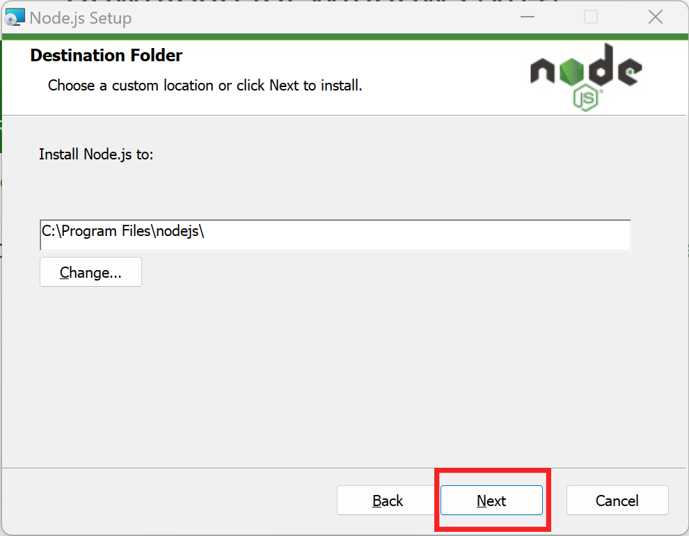

# An Intro to Using HTTP APIs with Node

## Our Mission

It's great to be part of a community. GitHub is a great site for connecting with a *community* of other developers working on similar projects. GitHub lets you follow developers, star their repos, see what they are working on, etc. What it does *not* let you do, sadly, is communicate directly with another developer on the site (unless you are both working together on a PR, or issue, etc). 

However, GitHub gives each developer the option to this their social media links on their GitHub home page so that other developers can contact them on those sites! Problem solved!


Here, my friend's Twitter handle is `@washedPatrick`. I can go on Twitter and message him using that handle.

He can then go to my GitHub repository to find my Twitter handle so that he can respond:


That's great and all, but we're developers and we would prefer to automate the process of finding out how to connect with our peers on social media. If only there were some way that we could query GitHub's database of profiles and "fetch" all the social media links for a particular user. 

Well, have no fear, because there is!!

In this tutorial we are going to study how we can use HTTP APIs, the "things" that give us access to information like we talked about above, by writing JavaScript code! 

While we are not going to write an Internet server (what is called in today's modern language a *backend* [see below]), we are going to write an application that is analogous to it using the exact same tools and technologies.

Let's go!

## Node

ECMAScript, the formal name for the JavaScript programming language, finds its most common use in the web browser. Firefox, Chrome, Safari, Brave and all the other major web browsers have support for running programs written in JavaScript. Before JavaScript became the language it is today, most web sites were designed to be read -- their content was static and user interaction with the material was limited, at best. As JavaScript grew more powerful, JavaScript programs turned web sites into web apps. Because JavaScript programs can run the same way in *every* web browser (although that is the ideal, the truth is far different), many developers know the language well. In modern lingo, JavaScript programs that run in a user's web browser are known as frontend applications and developers who write those applications are known as frontend developers.

On the other hand, most of the server software (e.g., web servers, database servers, etc.) that people write have historically been written in languages with a steeper learning curve: C, C++, Java, Python, etc. Fewer people know these languages which means that the pool of developers qualified to write server software was smaller. Server software are referred to as backend software and its developers are known as backend developers. 

Because knowledge of programming in JavaScript is so pervasive, developers thought that it would be great to empower those JavaScript junkies to write server software. Because JavaScript was a language designed to build frontend applications that execute in a web browser, there are many things missing from the language that are required for writing servers: JavaScript does not give its programmers the ability to access a computer's storage or peripherals, for example. Most importantly, however, JavaScript programs cannot execute natively on a server. Unlike a program written in a language that is compiled to machine code (e.g., C, C++, Rust, etc), JavaScript programs must be executed by a runtime. Each web browser has a built-in runtime (Chrome has [V8](https://v8.dev/), Firefox has [SpiderMonkey](https://firefox-source-docs.mozilla.org/js/index.html), Safari has [JavaScriptCore](https://developer.apple.com/documentation/javascriptcore)).

So, right off the bat, the people who wanted to expand server development to JavaScript programmers needed to figure out how to build a JavaScript runtime that would make it possible for programs written in JavaScript to

1. execute on the server (with reasonably good performance!); and
1. access all the pieces of the operating system required for writing servers.

They accomplished this technical feat by isolating those JavaScript runtimes from the browser, wrapping them in some wizardry, and publishing them as standalone applications. The result are so-called JavaScript runtimes (I know, it's confusing, sorry!) like Node.js, Deno, and Bun ([among others](https://en.wikipedia.org/wiki/List_of_server-side_JavaScript_implementations)).

Because JavaScript is standardized (as ECMAScript), it *should* be possible to write a program in JavaScript that will run the same way in any of those runtimes. That is, however, not entirely true -- each runtime supports the standard to various degrees and each offers their own extra special goodies.

In this tutorial we will use Node.js as the server runtime. The JavaScript program that we are going to write is not server software, per se. However, it will be a useful approximation in so far as both the application that we write and server software execute on a server (as opposed to in the browser) and both usually require access to external resources.

### Getting Started With Node

All the tools that you need to write software in JavaScript and execute it in Node are freely available on the Internet. Before going any further, make sure that you have [VS Code](https://code.visualstudio.com/download) installed on your Windows computer (versions of the tutorial for macOS and Linux are forthcoming). 

To start, download the Node installer from their website, [nodejs.org](https://www.nodejs.org).


Install the latest "LTS" version of Node. LTS stands for Long-Term Stable and describes a version of software that the Node developers guarantee they will support for an extended period of time by releasing security and stability updates, where needed.

After the installer has finished downloading, click on the downloaded file to launch it.


Depending on your browser and security settings, you may see a prompt warning you about executing programs downloaded from the Internet.


During the installation process, accepting the defaults is usually the best approach. The only caveat is that you will need to accept the license agreement for the software.


Be sure to check the box highlighted in green before clicking `Next`.

For the remaining steps, accepting the defaults is the way to go:




After clicking `Next`, Windows will prompt you to give the installer privileges to make changes to your hard drive. Unless you consent, the installer will not work.


Congratulations! You made it!


## APIs

Programmers are lazy people. They do *not* want to do again work that someone else has already one. That, of course, is the cynical description of programmers. The more generous description of programmers is that they are at pains to make sure that someone else's good work gets reused. 

In all seriousness, software reuse is at the bedrock of good software architecture. There are many reasons why it make sense for a programmer to reuse another piece of software that is well written, well maintained and well tested. That discussion, however, is for another day. Let's grant the premise that software reuse is a good thing.

Let's talk about software reuse at a local level. In your projects you will often write functions that accomplish some task that you might need to execute over and over again. Great, now you can reuse that functionality by doing a local function call. However, you might want to share that functionality with developers from another project who needs the same behavior. If they are writing software for the same type of hardware as you are and using the same language, you can package your functions in a *library* and share it with them. Those developers would import your library and, again, execute local function calls to reuse it. 

Writing functions allows *you* to reuse your software. Writing libraries allows *more* people to reuse your software. But what if you wanted *everyone* to be able to use your software? You would put that function on a server on the Internet and let people execute it *remotely*. When someone used your software they would be performing a *remote* function call (in the lingo these calls are known as *RPC*s for *remote procedure call*s -- procedure is (almost) a synonym for function). In order for everyone to understand the inputs and outputs of your globally accessible function (i.e., the parameters that it needs to execute and the results that it produces), there needs to be a specification. Such a specification is known as an application programming interface, an *API*. 

Historically there have been many ways to perform RPCs -- CORBA, Open Network Computing, Java RMI, SOAP, etc. The common way to perform RPCs today is to make requests via HTTP. APIs that are invoked over HTTP (and meet other criteria) are usually referred to as REST APIs: [REpresentational State Transfer](https://en.wikipedia.org/wiki/Representational_state_transfer). The "big idea" is that every request from the user of the RPC must contain enough information for the server to execute without having to maintain any *state*, information specific to the caller's invocation of the function. 

For example, when you call Papa John's and order a pizza, there is a conversation between you and the person answering the phone:

* You
    > I'd like to order a large, two topping pizza.
* Them
    > What is the first topping that you would like?
* You
    > Cheese.
* Them
    > What is the second topping that you would like?
* You
    > Pineapple
* Them
    > Great, a two topping large pizza with pineapple and cheese will be $17.00.

Despite the fact that pineapple does not go on pizzas, for the duration of the phone call, the operator needs to remember that you are asking for a two-topping large pizza and all the toppings that you have requested so far, how many you still need to select, etc. That is *state*.

Consider this alternate form of the same conversation:

* You
    > I'd like to order a large, two topping pizza.
* Them
    > You need to tell me the toppings you want on your large, two topping pizza.
* You
    > I'd like to order a large, two topping pizza with cheese.
* Them
    > You need to tell me the toppings you want on your large, two topping pizza.
* You
    > I'd like to order a large, two topping pizza with cheese and pineapple.
* Them
    > Great, a two topping large pizza with pineapple and cheese will be $17.00.

During this conversation, the operator only needs to have listened to the most-recent bit of dialogue to remember what they were doing. In other words, the operator needs no state. The ability to serve customers without keeping state would make it easier for the operator to serve multiple clients at the same time and maintain their sanity.

In an HTTP invocation of an RPC, the contents of a request and response are often encoded in JSON, the *JavaScript Object Notation*. The encoding mechanism is so called because it is a way to write down how an object in a program written in the JavaScript language would look if you wrote it out (to the screen, to a piece of paper, etc). The process of writing out a representation of something in the memory of a computer program is known as serialization. 

The awesome thing about data encoded in JSON format is that the programmer can read in that data and then *deserialize* it, convert it from the written-out format back in to an in memory representation that can be used directly in a program.

Woah!

You will see just how powerful that convenience is as we tackle our development!

Oftentimes local functions are meant to accomplish some task and perform some action -- write data to a file, make something appear on the screen. There are HTTP APIs that also accomplish tasks and perform actions. Some of the most famous web-based businesses publish HTTP APIs that perform actions like sending text messages (Twilio), computing a route between two waypoints (Here.com), transferring money between bank accounts (Stripe, Zelle), or authorizing users (PingOne, Duo). 

However, a majority of people use HTTP APIs to make RPCs that simply access databases. In a way, these remote procedures that deliver data on demand *are* procedures. But, in a way, they aren't. Nevertheless, these databases are accessible by HTTP APIs and are wildly popular. Some of the most famous ones include the Facebook API, the Instagram API, the Google Maps API, and so on.

In order to make a RPC to an HTTP API you need to know that API's *endpoint*. The *endpoint* is the address to which you connect in order to invoke the reusable functionality. For a REST HTTP API, the endpoint usually looks like any other URL.


### Making APIs Real and Tangible

Just what does it look like, practically, to call an HTTP API. In fact it's not much different than loading a web page. You can technically make a RPC over HTTP using your web browser.

Paste the following endpoint in your web browser:

```
https://api.sunrise-sunset.org/json?lat=39.1031&lng=-84.5120&date=2021-11-10
```

That URL invokes an HTTP API that will display information about the sunrise/sunset of any location on earth for any day in history. The HTTP API access above (called a *query*) contains all the arguments for the API's parameters. You don't even have to look that close to see them:

The `lat=` after the `?` means that the next value in the string is an argument for the `lat` parameter (the latitude); the `lng=` after the `&` means that the next value in the string is an argument for the `lng` parameter (the longitude); and the `date=` means that the next value in the string is an argument for the `date` parameter. The `&`s separate the parameter/argument pairs. 

Put all that information together and the query above is, essentially, asking the `sunrise-sunset.org` API for information about the sunrise/sunset on November 10th, 2021 in Cincinnati, OH. 


The result of that RPC invocation is formatted in JSON and your web browser knows how to pretty print the results. So, each of the labels in blue are the names of fields and the values in pink are the corresponding data bits. The output indicates that the sunrise in Cincinnati in November of 2021 was at 12:21:41 PM (yes, *PM* -- they are encoded in GMT). 

The amount of data accessible with these APIs is endless and it's really cool to see how things work!

## Nuts and GitHub Bolts

Returning to the task at hand -- we want to use a GitHub HTTP API in order to fetch the social media links for a particular user. Before we write a program in JavaScript to access this information, let's explore the API first and see what information is available.

> Note: When you are writing software that accesses any API, it is usually a very good idea to explore the API by hand before you start writing code. Making one-off calls to reusable code (whether that is a local function call or an RPC accessible as an HTTP API), knowing well how the API works will help you eliminate uncertainty when you are debugging your code: Is what I wrote incorrect or is there something odd about the interface? 

In order to access all the social media links for a particular user on GitHub, you can make a RPC to the HTTP API endpoint at

`https://api.github.com/users/`*username*`/social_accounts`

If you have a GitHub account and have registered your social media accounts, you can try it for yourself. My username on GitHub is `hawkinsw`. In order to retrieve all the social media accounts linked to my GitHub username you would call the GitHub API over HTTP by accessing the 

```
https://api.github.com/users/hawkinsw/social_accounts
```


As before when we were experimenting with the Sunrise-Sunset API, the result of the RPC is JSON and the web browser is pretty printing it to make it easier to read.

Because of the verbosity and self-documenting nature of JSON, you can almost read the data that we are after:

> The user `hawkinsw` has `0`, `1` social media accounts linked to their username. The `0`th account is from Twitter and the URL is `https://twitter.com/hawkinsw`. The `1`th account is from a generic social media company and the user `hawkinsw` can be contacted at `https://bsky.app/profile/hawkinsw.bsky.social` on that platform.

Experiment with the endpoint and make sure you see how it works. As we discussed above, having a good sense of how the API works will make it *that* much easier to access it programmatically in code.

## Building Software in the Node Ecosystem

Now that you know what APIs are, why you want to use them and several examples of their functionality, let's use JavaScript to write a backend program that will access a particular API and display its results.

No developer works alone -- we all write software that builds upon the tools and code that others have written before us. Whether we rely on the operating system, a library from another developer, or a function written by "past us", we are all using code from another developer.

Traditionally one of the hardest parts about software development has been finding and integrating these reusable pieces of functionality into a new project. In the past you would have to go out and find some useful source code, add it to your project, determine how to reference that code from your code, and so on.

Well, besides blowing open the opportunity to write server software to JavaScript developers, Node.js (and the other runtimes, too), revolutionized software engineering by introducing something called a *package manager*.

> Note: There have been package managers around in other forms for a long, long time. However, the Node Package Manager (NPM) was the first one that really caught the attention of an entire developer community.

Thanks to the Node.js Package Manager (NPM), you can issue a few simple commands and have access to any of a number of different libraries that have useful functionality for reuse.

NPM has a repository ([online](https://www.npmjs.com)) where 

1. developers can post packages for others to use; and
2. developers can look for packages to use in their projects.

When a developer wants to share some of their functionality with others, they simply publish their code to the repository. And then, when a developer wants to reuse someone's functionality, they can use a tool on their computer to download that package and have it immediately available for reuse.

For the project we are writing, it will be useful to be able to download data from the network using HTTP -- after all, that *is* what calling an HTTP API is all about! Unfortunately, writing code to access resources over the Internet, especially ones hosted on a web server, is not easy. 

Enter NPM which hosts a package just for that: `got`.

Before we can reach out and access that functionality, we will need to till the soil, so to speak.

### Initializing a New Project

First things first: we will need a place to store our code -- a well-named folder is always a good idea -- and we will need to configure our IDE so that it knows we are working with code in that folder. We can do both of those at the same time with VS Code.

Click on `Open Folder` under the `File` menu.


Then navigate to the place on your hard drive where you would like to store code for this project.

Click on the `New Folder` button to create a folder just for the code for this project.


Then you will descend in to that newly created folder by double clicking (I know, it's odd that Windows does not automatically do that for you, but ..).


Once you are in the newly created folder (which will have no contents), you can `Select Folder`:


With that, have to (basically) instructed VS Code that the newly created folder is a "workspace" for your project. Our configuration and project building can now really pick up some speed!

Now that we are starting to work with real code, we'll have to sometimes use another tool from VS Code -- the *terminal*. The terminal gives you access to an interface to issue commands (in a text format) to the computer. Working effectively in the terminal is real skill and one that developers spend lots of time practicing. Every platform (Windows, macOS, Linux) has individual pieces of software that will give you access to the terminal (a *terminal emulator*) and each of those packages has its pros and cons. What's cool about VS Code is that there is a (reasonably decent) built-in terminal emulator. In order to access the terminal emulator in VS Code, click on `New Terminal`.


What appears is the terminal window and it's a place where you can enter commands for the operating system to execute.

*Now* we can finally start to use the Node.js Package Manager! In order for our software to easily reuse functionality posted in the NPM repository, we will create a project. In the terminal window, type :

```console
npm init
```

and then press Enter. `npm` will prompt you through the steps of creating a new package:

```
This utility will walk you through creating a package.json file.
It only covers the most common items, and tries to guess sensible defaults.

See `npm help init` for definitive documentation on these fields
and exactly what they do.

Use `npm install <pkg>` afterwards to install a package and
save it as a dependency in the package.json file.

Press ^C at any time to quit.
package name: (scratch) 
```


I recommend calling your project `getsocial` (because we are going to use `G*i*tHub`) to access information about a developer's presence on social media. To do that, just type `getsocial` and press enter. The next question asks you to set the value for `getsocial`'s latest version.

```console
version: (1.0.0)
```

The value in `()`s is the *default* choice and if you want to accept that value (I recommend that you do), simply press return. You can complete the remainder of the `npm init` process by either accepting the defaults or setting meaningful customized values. The only item that you must set precisely is the `entry point` option -- simply set it to `index.js`. That is setting the name of the file that will contain the code that starts our application!

The result of the initialization process is several new files. The most important one is the `package.json` file. It describes your package (for future you and, potentially, for others if you post it on the NPM repository eventually) but, crucially, also keeps track of the software that your package relies on from the NPM repository.

If you look inside `package.json` that `npm init` created, you will see something like


```json
{
  "name": "gitsocial",
  "version": "1.0.0",
  "description": "Getting social media information from GitHub",
  "main": "index.js",
  "scripts": {
    "test": "echo \"Error: no test specified\" && exit 1"
  },
  "author": "Will Hawkins",
  "license": "GPL-3.0-or-later"
}
```

The file should not contain anything surprising -- just exactly the things you just typed in when prompted by `npm init`. Now here comes the cool part.

### `got` To Get A Package

So far we have come a very long way, even though we haven't yet written any code. We have

1. Learned *what* is an API;
2. Learned *how* we access that API remotely;
3. Learned *why* we want to use APIs;
4. Configured the IDE; and
5. Initialized a Node.js project.

Time to take a break. 

Just kidding, of course. Lets keep moving and set ourselves up so that `gitsocial` can reuse the functionality provided by the `got` library:

```console
npm install --save got
```

Something like

```
up to date, audited 23 packages in 512ms

10 packages are looking for funding
  run `npm fund` for details

found 0 vulnerabilities
```

should have popped up on your screen (red arrow).


You will see a few things have changed. First, there is a new directory named `node_modules` in the current folder (blue arrow). That folder contains the code for the `got` library that you just installed. Second, a few new items were added to `package.json`:

```json
{
  "name": "gitsocial",
  "version": "1.0.0",
  "description": "Getting social media information from GitHub",
  "main": "index.js",
  "scripts": {
    "test": "echo \"Error: no test specified\" && exit 1"
  },
  "author": "Will Hawkins",
  "license": "GPL-3.0-or-later",
  "dependencies": {
    "got": "^13.0.0"
  }
}
```

The new entries after `dependencies` reflect the that you told NPM that for your software to work, it *must* have access to the `got` package. Then, if you ever move to a new computer and start developing this software there, NPM will know which pieces of external code it will have to download from the NPM repository in order to make it possible for you to write more code! 

How cool is that?

NPM does *so* much more than what we've just described and you will learn all that functionality as your learn and grow as a developer.

> Note: Whether you realize it or not you are already get expertise and experience with the JSON format. I am sure that you noticed that the `package.json` had the `.json` file extension and I bet you were wondering what that had to do with the JSON format we described above! Well, as you can see, the contents of the `package.json` file are just, well, JSON! How cool is that??

## Drumroll, please ...

Now the moment that we have been waiting for ... writing some code. 

Psych!

We have to do one other bit of plumbing! Remember when we were running `npm init` and accepting all of its defaults? Well, one of those defaults was the name of the file where the main pieces of code for our project will go. By default, NPM wanted us to put the main pieces of the project's code in `index.js` and we agreed. So, we will need to create such a file so we can start adding JavaScript to it.

Click on the `New File` icon and name the file `index.js`.


If your screen looks (something) like 


then you are ready to roll! Let's get started!

In the `index.js` file, let's write a very simple program and see how to execute it using Node. 

```javascript
console.log(`Hello, World!`)
```

That line of code will produce the words `Hello, World!` on the screen. Do you believe me? You should! But, also, I don't blame you. So, let's verify! If we want to run the code that we have written and see what it produces, we have two options. 

The first way to execute a piece of JavaScript that we have written is to us the UI. In the `Run` menu, click on `Start Debugging`. The first time that you execute a JavaScript program with Node.js in this way, VS Code will ask which runtime to use. Of course, we want Node.js, but VS Code does not know that. When you click `Start Debugging` you will see popup window asking how to execute the JavaScript in `index.js`. Click on `Node.js`. 

```console
Hello, World!
```

Wow! Just what we expected! What is the difference between `Start Debugging` and `Run Without Debugging`? Well, the former instructs Node.js to begin executing the program written in JavaScript and give you the opportunity to stop it at any moment and inspect its status using a very powerful piece of software known as the debugger. You will become an expert using the debugger as you work through your career. There are debuggers for (almost) every programming language and environment. The debugger for JavaScript built in to VSCode is reasonable!

The second way to execute a piece of JavaScript that you have written is in the terminal. Open up a terminal window (remember how we do that?). Next, make sure that we are in the proper directory. Every time you issue a command using the terminal on the command line, it is executed in the context of a particular directory (i.e., a *folder*). The directory forming the context in the terminal is known as the *working directory*. Thanks to the working directory, any command executed can refer to files in that directory without having to give a complete *path*, or list of the folders encompassing a particular file with respect to the base of the hard drive. In order to see the names of the files that are "in" the working directory, we can execute `dir`. Give it a try:

```console
$ dir
```

The output will be (something like):
```console
index.js  node_modules  package.json  package-lock.json
```

What do you know? `index.js` (the file where we have the code for our program) is right there!

To instruct Node.js to execute the JavaScript in that file, we can issue the following command:

```console
node index.js
```

and the output should be:


```console
Hello, World!
```

Let's do some more introductions. Make sure that the code in your `index.js` looks like:

```JavaScript
console.log(`Goodbye!`)
console.log(`Hello, World!`)
```

Using your favorite technique for running JavaScript programs using Node, run the new program.

```console.log
Goodbye!
Hello, World!
```

There are few important things to notice here:
1. We are saying goodbye before we are saying hello! Odd!
2. Node appears to be executing each of the JavaScript statements from the top of the file containing the program's source code to its bottom.

Fix up the JavaScript program that we are writing so the it says hello and goodbye in the proper order.

## Doing Real Work

The format of the code in a JavaScript program is much different than in other languages. For instance, in C++, statements outside functions are not executable and all the code that can be executed needs to be in either a function or a class.

> Note: That is not *entirely* true.

The Node.js runtime will execute the statements in a JavaScript program from top to bottom and (essentially) skip any JavaScript that is in a function or class that is not specifically invoked. How wild is that?

In order to keep our code nice and tidy, we will write all of our code in functions and then invoke a "main" function as the sole executable statement outside a function in `index.js`. That will help us in two weeks when we come back to this program and try to decipher our intentions.

Because it will be the main point of departure for a program's execution, let's name the function `main`. Our function will take no parameters and it will return no values. 

```JavaScript
function main() { 

}
```

is how to define a simple function in JavaScript that takes no parameters and returns no values.

Put your updated `console.log` statements inside the `main` function:

```JavaScript
function main() { 
  console.log(`Hello, World!`)
  console.log(`Goodbye!`)
}
```

Now, run your program:

```console
```

Where did our output go? Well, we moved all the executable code into a function definition (something that is not executable) but then never invoked that function! Geez. We can easily fix that:

that 

```JavaScript
function main() { 
  console.log(`Hello, World!`)
  console.log(`Goodbye!`)
}

main()
```

And now we get our functionality back:


```console
Hello, World!
Goodbye!
```

## Build It And They Will Come

